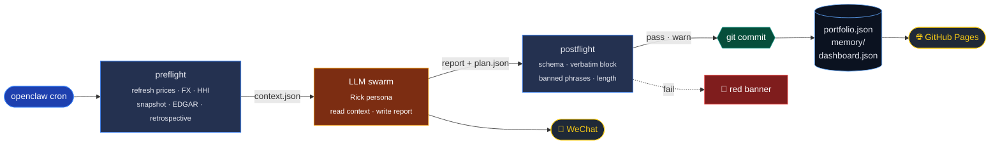
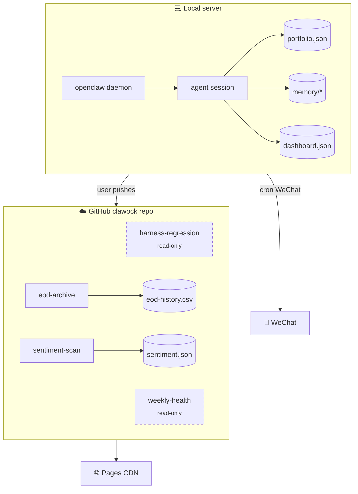
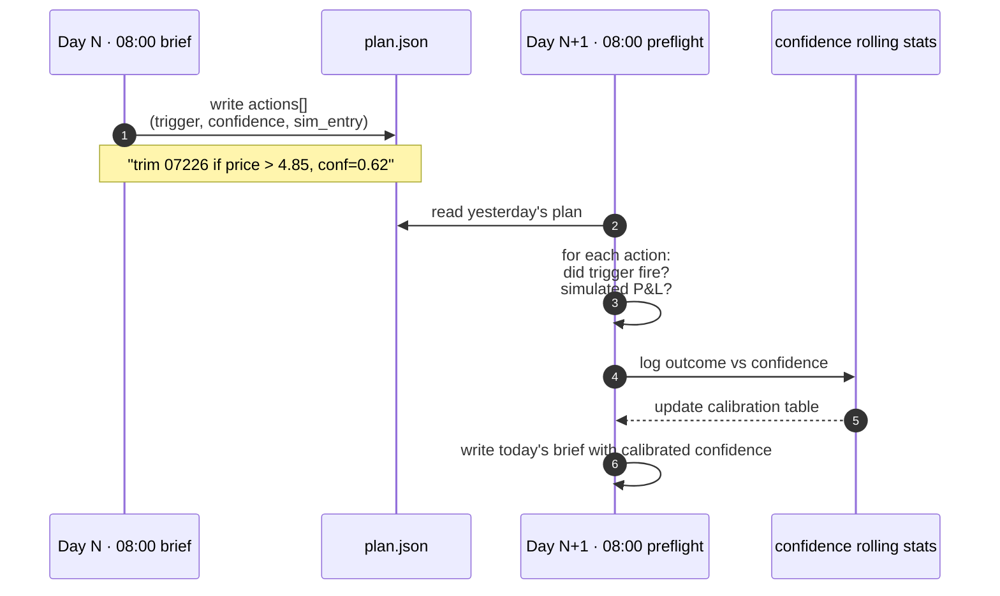

<div align="center">

# 📈 clawock

**Harness-driven HK + US portfolio analysis** · multi-agent LLM swarm · self-learning daily briefs · live dashboard

[](https://kcnyu.github.io/clawock/)
[](https://github.com/KCNyu/clawock/actions/workflows/harness-regression.yml)
[](https://github.com/KCNyu/clawock/actions/workflows/weekly-health.yml)
[](https://github.com/KCNyu/clawock/actions/workflows/sentiment-scan.yml)
[](#license)

[**🎯 Live Dashboard**](https://kcnyu.github.io/clawock/) · [**📅 Daily Briefs**](https://kcnyu.github.io/clawock/briefs.html) · [**🧠 Architecture**](#-architecture)

<br>

<a href="https://kcnyu.github.io/clawock/">
  
</a>

<sub>Live ECharts dashboard · auto-refreshed after every cron run · open the link above</sub>

</div>

---

## ✨ What this is

A real personal investment workspace.

Every weekday, a cron daemon ([openclaw](https://openclaw.com)) wakes up, picks the best available LLM from
a fallback chain (MiniMax → Xiaomi MiMo → GLM → DeepSeek → Claude → GPT), and lets that model — playing the
persona `Rick` — analyse the HK + US legs of a real portfolio. The model ships briefings to WeChat and
refreshes a public dashboard.

Two things make it different from a generic "AI trader" demo:

1. **Harness pattern** — every cron job is split `preflight (Python) → LLM (synthesis) → postflight (validate + commit)`.
   Deterministic work like price refresh, FX conversion, HHI computation, signal counting runs 100% in Python.
   The LLM is only allowed the parts that can't be scripted: writing the take. Missing a snapshot, forgetting FX,
   omitting a >3% mover — all caught and the report is flagged.
2. **Self-learning loop** — every brief commits a structured `plan.json`. Next day's preflight reads it back,
   computes which triggers fired, simulates the P&L, and feeds confidence calibration to the LLM.

---

## 🏗 Architecture

### The harness pipeline



> Deterministic work (prices · FX · HHI · signals) runs 100 % in Python so the LLM can't skip it.
> The LLM owns only the synthesis. Postflight catches missing snapshots, omitted movers, banned phrases.

### LLM fallback chain (`~/.openclaw/openclaw.json`)

```mermaid
flowchart LR
    p[MiniMax M2.7<br/><sub>primary</sub>]:::primary
    f1[Xiaomi MiMo v2.5 Pro<br/><sub>fallback 1</sub>]:::fb1
    f2[GLM 5.1<br/><sub>fallback 2</sub>]:::fb
    f3[DeepSeek v4 Pro<br/><sub>fallback 3</sub>]:::fb
    f4[Claude Sonnet 4.6<br/><sub>fallback 4</sub>]:::fb
    f5[Claude Haiku 4.5<br/><sub>fallback 5</sub>]:::fb
    f6[GPT-5.5 proxy<br/><sub>fallback 6</sub>]:::fb

    p -->|fail/timeout| f1
    f1 -->|fail| f2
    f2 -->|fail| f3
    f3 -->|fail| f4
    f4 -->|fail| f5
    f5 -->|fail| f6

    classDef primary fill:#26a69a,stroke:#fff,color:#fff,stroke-width:2px
    classDef fb1     fill:#f59e0b,stroke:#fff,color:#fff
    classDef fb      fill:#1e40af,stroke:#60a5fa,color:#fff
```



> All providers speak the OpenAI completions protocol. Xiaomi MiMo runs with
> `thinking: disabled` to avoid the `reasoning_content` multi-turn quirk.

### Local cron ↔ remote CI



> Zero conflict: openclaw writes `dashboard.json`; GH Actions write `sentiment.json` and `eod-history.csv` (disjoint).
> No shared filesystem race.

---

## 📅 Daily trading-day timeline (HKT)

```mermaid
gantt
    title Stock cron jobs across a weekday
    dateFormat HH:mm
    axisFormat %H:%M

    section System
    Memory dreaming            :03:00, 5m
    Daily deep brief (swarm)   :crit, 08:00, 30m

    section HK leg
    HK open report             :09:30, 10m
    HK intraday (every 30 min) :active, 09:30, 6h
    HK mid-day                 :12:00, 10m
    HK afternoon               :13:30, 10m
    HK close                   :16:00, 10m

    section US leg (= 21:30+ HKT)
    US open report             :21:30, 10m
    US intraday (every 30 min) :active, 21:30, 6h30m
    US close                   :04:00, 10m
```



## ⚙ Cron map (10 jobs · openclaw scheduler)

| Time | Job | Mode | Harness |
|---|---|---|---|
| **03:00** daily | Memory dreaming promotion | _system_ | — |
| **08:00 HKT** weekday | 📊 Daily deep brief | `daily-deep-brief` (Tier 1/2/3 + Judge) | `brief_preflight` / `brief_postflight` |
| **09:30 HKT** weekday | HK open report | Mode 6 | `report_preflight --market hk --phase open` |
| **09:00–15:30 HKT** every 30 min | HK intraday monitor | Mode 7 | `intraday_preflight --market hk` |
| **12:00 HKT** weekday | HK mid-day | Mode 6 | `--market hk --phase mid` |
| **13:30 HKT** weekday | HK afternoon | Mode 6 | `--market hk --phase pm` |
| **16:00 HKT** weekday | HK close | Mode 6 | `--market hk --phase close` |
| **09:30 ET** weekday | US open | Mode 6 | `--market us --phase open` |
| **09:00–15:30 ET** every 30 min | US intraday monitor | Mode 7 | `intraday_preflight --market us` |
| **16:00 ET** weekday | US close | Mode 6 | `--market us --phase close` |

Plus 4 GitHub Actions for backstop / extras:

| Workflow | When | Writes |
|---|---|---|
| `harness-regression.yml` | push | (read-only schema check) |
| `weekly-health.yml` | Sundays 23:00 UTC | (read-only deeper check) |
| `eod-archive.yml` | Fridays 22:00 UTC | `memory/archive/eod-history.csv` |
| `sentiment-scan.yml` | weekdays 23:30 UTC | `assets/data/sentiment.json` |

---

## 📂 Repository layout

```
clawock/
├─ index.html  briefs.md  README.md          ← Pages landing + this file
├─ assets/                                   ← Pages static
│  ├─ dashboard.css  dashboard.js
│  └─ data/dashboard.json    ← built by harness postflight, never hand-edit
│
├─ portfolio.json                            ← single source of truth (atomic writes)
├─ memory/
│  ├─ {YYYY-MM-DD}.md           handwritten notes
│  ├─ {YYYY-MM-DD}-pre-open.md  daily deep brief output
│  ├─ {YYYY-MM-DD}-plan.json    structured plan (next-day retrospective input)
│  ├─ snapshots/{date}.json     daily portfolio snapshot
│  └─ archive/eod-history.csv   weekly EOD archive (GH Action)
│
├─ scripts/
│  ├─ data/                     fetchers + dashboard builder + safe_io (atomic writes)
│  ├─ harness/                  preflight + postflight pairs (6 files, 4 pairs)
│  └─ legacy/                   superseded scripts kept as reference
│
├─ skills/{name}/SKILL.md       Claude Code skill bodies
│
└─ _layouts/default.html        Jekyll layout · all md pages render in dashboard's dark theme
```

---

## 🚀 Quickstart

```bash
# 1. Refresh US prices (7-route fallback)
python3 scripts/data/analyze_us_stocks.py

# 2. Refresh HK prices (Tencent → stooq → yfinance)
python3 scripts/data/analyze_hk_stocks.py

# 3. Run a brief manually
python3 scripts/harness/brief_preflight.py    # produces memory/.tmp/brief-context-*.json
# … (LLM writes memory/{date}-pre-open.md + plan.json) …
python3 scripts/harness/brief_postflight.py   # validates, rebuilds dashboard, commits

# 4. Preview the dashboard locally
python3 scripts/data/build_dashboard.py
python3 -m http.server 8080
# → http://localhost:8080/
```

API keys (Finnhub, Alpha Vantage, Polygon, …) live in `.api_keys` (gitignored).
All scripts work without keys — just with reduced data quality.

---

## 📜 Iron rules

> The constraints postflight enforces. They would otherwise be invisible to a reader scanning the code.

### 🪙 FX — HKD + USD never sum directly

HK leg is denominated in HKD, US leg in USD. Adding them naively gives a meaningless number.
Book totals must always be presented in **both views**, with the rate and timestamp stamped:

```
Total P&L: USD${X}  ≈  HKD${Y}      (USDHKD = 7.83, source Frankfurter, 2026-05-16T12:00Z)
  ├─ HK leg: HKD${a}  ≈  USD${a / 7.83}
  └─ US leg: USD${b}  ≈  HKD${b * 7.83}
```

### 📊 Concentration — HHI

For each leg separately:
- `weight_i = current_value_i / leg_total_value`
- `HHI = Σ weight²` · `Top2 = sum of two largest weights`

| HHI | Top 2 | Status |
|---|---|---|
| < 0.15 | < 40% | ✅ healthy |
| 0.15 – 0.25 | 40 – 60% | 🟡 moderate |
| 0.25 – 0.40 | 60 – 75% | 🟠 concentrated |
| > 0.40 | > 75% | 🔴 dangerous |

### 🎲 Leverage ETF heuristic

Preflight skips SEC EDGAR for tickers whose name contains `倍 / Direxion / T-Rex / Defiance / ProShares / 2X Long / 3X Long / Daily Target`.
For leveraged ETFs, fundamentals are noise — look at the underlying instead.

---

## 🤖 Self-learning loop



Every daily-deep-brief commits `memory/{date}-plan.json`:

```jsonc
{
  "date": "2026-05-16",
  "buckets": { "cut": [...], "trim_on_rebound": [...], "hold_and_watch": [...],
               "t_only": [...], "add_only_on_trigger": [...] },
  "actions": [{
    "ticker":       "07226",
    "bucket":       "trim_on_rebound",
    "trigger_type": "price_above",
    "trigger":      "trim 1000 shares if price > 4.85",
    "confidence":   0.62,
    "simulated_entry_price": 4.49
  }],
  "context": { "hhi_us": 0.21, "hhi_hk": 0.34, "fx": 7.83 }
}
```

Next morning's preflight loads it back and for each action computes:
1. **Did the trigger fire?** (vs. actual price action)
2. **Simulated P&L** if action had been executed at trigger
3. **Confidence calibration** — log into rolling stats

Design heavily inspired by [TauricResearch/TradingAgents v0.2.4](https://github.com/TauricResearch/TradingAgents)'s persistent decision memory, adapted for HK + US dual-leg portfolios.

---

## 🧬 Stack

[Claude Code](https://claude.com/claude-code) · [openclaw](https://openclaw.com) ·
[ECharts 5.5](https://echarts.apache.org/) · Jekyll + GitHub Pages · Python 3.11 · pure static frontend

**Public data sources** Tencent · stooq · yfinance · Frankfurter · SEC EDGAR · Finnhub · Nasdaq API · Eastmoney · Polygon · Alpha Vantage · Reddit JSON

---

## ⚠️ Disclaimer

This repository contains **real trading positions**. It is shared publicly for personal record-keeping and as a
portable workspace — **not investment advice**, not a recommendation, not anything you should copy.
Every number is point-in-time and may already be stale by the time you read it.
The persona (`Rick`) is opinionated by design — that doesn't make it right.

---

## 📄 License

Personal-use repository. No license granted for derivative trading systems, automated copy-trading, or commercial use.
Code patterns (harness layout, fallback chain design, HHI formulation, atomic IO) may be adapted under any compatible
open-source license of your choosing if reused independently.

---

<div align="center">
<sub>Built and maintained by <a href="https://github.com/KCNyu">Shengyu Li (kcn)</a> and Rick · 2026</sub>
</div>
