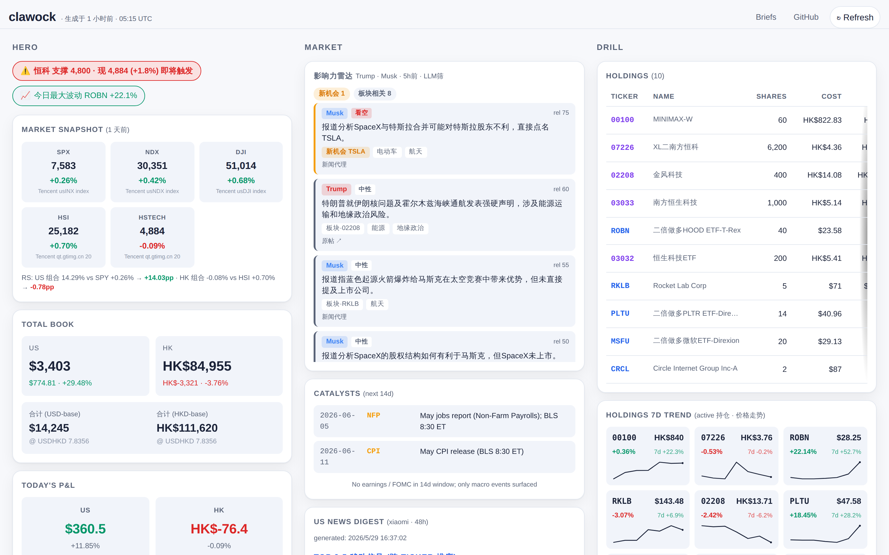
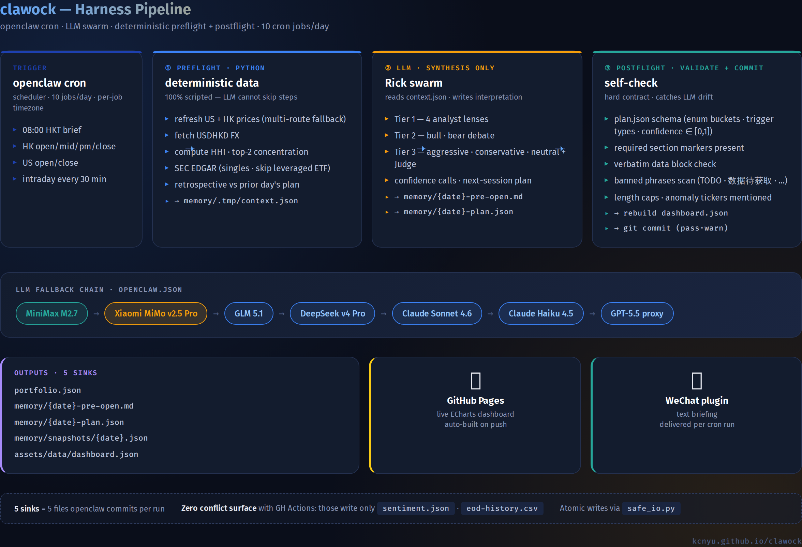

<div align="center">

# 📈 clawock

**Harness-driven HK + US portfolio analysis** · multi-agent LLM swarm · self-learning daily briefs · live dashboard

[](https://kcnyu.github.io/clawock/)
[](https://github.com/KCNyu/clawock/actions/workflows/harness-regression.yml)
[](https://github.com/KCNyu/clawock/actions/workflows/weekly-health.yml)
[](https://github.com/KCNyu/clawock/actions/workflows/cron-health.yml)
[](https://github.com/KCNyu/clawock/actions/workflows/sentiment-scan.yml)
[](#license)

[**🎯 Live Dashboard**](https://kcnyu.github.io/clawock/) · [**📅 Daily Briefs**](https://kcnyu.github.io/clawock/briefs.html) · [**🧠 Architecture**](#-architecture)

<br>

<a href="https://kcnyu.github.io/clawock/">
  
</a>

<sub>Screenshot refreshes weekly via <a href="https://github.com/KCNyu/clawock/actions/workflows/screenshot-refresh.yml">GH Action</a>; data on the live page updates after every cron run.</sub>

</div>

---

## ✨ What this is

A real personal investment workspace.

Every weekday, a cron daemon ([openclaw](https://openclaw.com)) wakes up, picks the best available LLM from
a fallback chain, and lets that model — playing the persona `Rick` — analyse the HK + US legs of a real
portfolio. The model ships briefings to WeChat and refreshes a public dashboard.

Three things make it different from a generic "AI trader" demo:

1. **Harness pattern** — every cron job is split `preflight (Python) → LLM (synthesis) → postflight (validate + commit)`.
   Deterministic work like price refresh, FX conversion, HHI computation, signal counting runs 100% in Python.
   The LLM is only allowed the parts that can't be scripted: writing the take. Missing a snapshot, forgetting FX,
   omitting a >3% mover — all caught and the report is flagged.
2. **Self-learning loop** — every brief commits a structured `plan.json`. Next day's preflight reads it back,
   computes which triggers fired, simulates the P&L, and feeds confidence calibration to the LLM.
3. **Defence in depth** — four independent layers (cron → GH Action backstop → system-crontab watchdogs →
   health sentinels) mean a single LLM stall, a missed cron, or a flaky data source never silently drops a report.

---

## 🏗 Architecture

<div align="center">
  
</div>

**Deterministic work** (prices · FX · HHI · signals) runs 100 % in Python so the LLM can't skip it.
The LLM owns only the **synthesis**. Postflight catches missing snapshots, omitted movers, banned phrases.

### LLM fallback chain

```
primary    xiaomi/mimo-v2.5-pro          (Anthropic-messages protocol · thinking: high · 1M ctx)
fallbacks  → minimax/MiniMax-M2.7        (openai-completions · 200k ctx · thinking: medium)
           → glm/glm-5.1
           → deepseek/deepseek-v4-pro
           → openai/gpt-5.5
           → anthropic/claude-sonnet-4-6
           → anthropic/claude-haiku-4-5
           → openai-proxy/gpt-5.5
```

Protocols are **mixed**: Xiaomi MiMo and the Claude models speak `anthropic-messages` (thinking is an
independent block); MiniMax / GLM / DeepSeek / OpenAI speak `openai-completions`. A third-party reasoning
model **must** be registered with `"reasoning": true` or its thinking silently locks off. GH Actions that
call an LLM directly (brief fallback, news digest, influence radar, weekly review) bypass the gateway and
hit Xiaomi → MiniMax through `scripts/data/xiaomi_llm.py`.

### Write reconciliation (the one hard part)

Four independent writers push to `master`: the openclaw cron daemon, 11 GitHub Actions, system-crontab
backstops, and ad-hoc sessions. They overlap on `assets/data/` — `dashboard.json` especially. Keeping that
consistent without a central lock is the only genuinely tricky bit:

- **GH Actions serialize among themselves** via `concurrency: group: data-write`.
- **Each data-producing GH Action rebuilds `dashboard.json`** when its sub-file actually changes, so the
  *published* dashboard never lags its own `macro` / `sentiment` / `influencer_feed` blocks (matters most on
  weekends, when there is no intraday rebuild).
- **The local harness pulls the other direction**: `sync_gha_data_files()` does `fetch + checkout origin/master -- <file>`
  for the GH-written files *before* `build_dashboard.py`, so a local rebuild embeds the freshest remote data
  without touching the rest of the working tree.
- **Every committer pushes through `safe_push.sh`** — rebase-retry, abort (don't loop) on a real conflict.
  System-crontab jobs use `rebase.autoStash` so a dirty host working tree doesn't block the rebase.

The residual risk is two writers racing on `dashboard.json` between rebuild and push; it self-heals on the
next rebuild and is never authoritative for portfolio numbers (those live in `portfolio.json`).

---

## ⚙ Cron map

### openclaw scheduler — 11 jobs (`Asia/Shanghai` tz, = HKT)

| Time (HKT) | Job | Mode | Harness |
|---|---|---|---|
| **03:00** daily | Memory dreaming promotion | _core, no LLM_ | committed by `commit_dreaming.sh` at 03:20 |
| **08:00** weekday | 📊 Daily deep brief | `daily-deep-brief` (Tier 1/2/3 + Judge) | `brief_preflight` / `brief_postflight` |
| **09:30** weekday | HK open report | Mode 6 | `report_* --market hk --phase open` |
| **10:00–11:30 + 14:00–15:30** /30 min | HK intraday monitor | Mode 7 | `intraday_* --market hk` |
| **12:00** weekday | HK mid-day | Mode 6 | `--market hk --phase mid` |
| **13:30** weekday | HK afternoon | Mode 6 | `--market hk --phase pm` |
| **16:00** weekday | HK close | Mode 6 | `--market hk --phase close` |
| **21:30** weekday | US open (≈09:30 ET) | Mode 6 | `--market us --phase open` |
| **22:00–23:30** /30 min | US intraday (early session) | Mode 7 | `intraday_* --market us` |
| **00:00–02:30** Tue–Sat | US intraday (overnight) | Mode 7 | `intraday_* --market us` |
| **04:00** Tue–Sat | US close (≈16:00 ET) | Mode 6 | `--market us --phase close` |

### Resilience layer — system crontab (LLM-free backstops on the host)

| Time (HKT) | Backstop | What it guards |
|---|---|---|
| 09:45 / 12:12 / 16:15 / 13:42 weekday · 04:20 / 21:45 | `report_watchdog.py` ×6 | If a report cron's LLM stalls/fails, push the deterministic `raw_wechat_block` straight to WeChat |
| **03:20** daily | `commit_dreaming.sh` | Commit + push the dreaming promotion the core appends to `MEMORY.md` / `DREAMS.md` but never commits |
| **03:30** daily | `gc_sessions.py` | Prune stale trajectory / bak / expired handoff (~9 GB/yr otherwise) |

### GitHub Actions — 11 workflows

| Workflow | When (HKT) | Writes / does |
|---|---|---|
| `brief-fallback.yml` | 08:25 weekday | Regenerate the daily brief via Xiaomi **if** openclaw didn't produce one |
| `sentiment-scan.yml` | 07:30 weekday | `sentiment.json` (Reddit + Google News) → rebuilds `dashboard.json` |
| `macro-scan.yml` | 07:45 weekday | `macro.json` (VIX / 10Y / DXY / Fear&Greed) → rebuilds `dashboard.json` |
| `influencer-scan.yml` | 07:40 + 20:50 weekday | `influencer_feed.json` (Trump Truth Social + Musk proxy, LLM-filtered) → rebuilds `dashboard.json` |
| `news-digest.yml` | 21:00 weekday | `us_news_digest.json` (Xiaomi-distilled, GNews fallback) |
| `eod-archive.yml` | Sat 06:00 | `memory/archive/eod-history.csv` — append-only audit trail |
| `cron-health.yml` | 17:00 weekday | Read-only: expected cron count vs actual commits → red badge + email on drift |
| `weekly-health.yml` | Mon 07:00 | Read-only deep check: scripts compile, schemas, dead cron paths, dead data sources |
| `weekly-review.yml` | Sun 22:00 | Weekly portfolio review via Xiaomi → WeChat |
| `screenshot-refresh.yml` | Mon 06:00 | `docs/dashboard-{preview,mobile}.png` so the README preview never drifts >7 days |
| `harness-regression.yml` | on push / PR | Read-only schema + compile gate |

> GH Actions scheduled crons routinely fire **1–2 h late** — no job relies on tight inter-job ordering;
> the brief fallback, for instance, waits 25 min past the openclaw brief before assuming it's missing.

> **One view of all three schedulers:** `./check_crons.sh --timeline` merges openclaw + GH Actions +
> system crontab into a single HKT-normalized timeline — applying the UTC→HKT day-of-week shift, so a
> GH Action written `* * 1-5` (UTC) is shown on its *real* HKT firing days. (Run history: `./check_crons.sh`.)

---

## 📂 Repository layout

```
clawock/
├─ index.html  briefs.md  README.md          ← Pages landing + this file
├─ assets/                                   ← Pages static
│  └─ data/                  built by harness postflight + GH Actions, never hand-edit
│     ├─ dashboard.json        v2.x schema (CSS/JS inlined in index.html since v2)
│     ├─ risk.json             β/Vol/DD/Sharpe (portfolio_risk_metrics.py)
│     ├─ catalysts.json        14d earnings + FOMC + macro (fetch_catalysts.py)
│     ├─ us_news_digest.json   xiaomi LLM 提炼 (news-digest.yml)
│     ├─ macro.json            VIX / DXY / Fed RSS (macro-scan.yml)
│     ├─ sentiment.json        Reddit + Google News (sentiment-scan.yml)
│     ├─ influencer_feed.json  Trump / Musk market-movers, LLM-filtered (influencer-scan.yml)
│     └─ fx.json               USDHKD (fetch_fx.py, 4h cache)
│
├─ portfolio.json                            ← single source of truth (atomic writes)
├─ MEMORY.md  DREAMS.md                       ← iron rules + dreaming promotion (auto-committed 03:20)
├─ memory/
│  ├─ {YYYY-MM-DD}.md           session / handwritten notes
│  ├─ {YYYY-MM-DD}-pre-open.md  daily deep brief output
│  ├─ {YYYY-MM-DD}-plan.json    structured plan (next-day retrospective input)
│  ├─ snapshots/{date}.json     daily portfolio snapshot
│  └─ archive/eod-history.csv   weekly EOD archive (GH Action)
│
├─ scripts/
│  ├─ data/                     fetchers + build_dashboard.py + portfolio_risk_metrics.py +
│  │                            fetch_{macro,sentiment,catalysts,fx,influencer_feed}.py +
│  │                            xiaomi_llm.py + gh_action_* (GH Action LLM entry points) +
│  │                            safe_push.sh + commit_dreaming.sh + gc_sessions.py + safe_io (atomic)
│  ├─ harness/                  preflight + postflight pairs (4 pairs) + report_watchdog.py + _harness_common
│  └─ legacy/                   superseded scripts kept as reference
│
├─ skills/{name}/SKILL.md       Claude Code skill bodies
└─ _layouts/default.html        Jekyll layout · all md pages render in dashboard's dark theme
```

---

## 🚀 Quickstart

```bash
# 1. Refresh US prices (7-route fallback)
python3 scripts/data/analyze_us_stocks.py

# 2. Refresh HK prices (Tencent → stooq → yfinance)
python3 scripts/data/analyze_hk_stocks.py

# 3. Run a brief manually
python3 scripts/harness/brief_preflight.py    # produces memory/.tmp/brief-context-*.json
# … (LLM writes memory/{date}-pre-open.md + plan.json) …
python3 scripts/harness/brief_postflight.py   # validates, rebuilds dashboard, commits

# 4. Preview the dashboard locally
python3 scripts/data/build_dashboard.py
python3 -m http.server 8080
# → http://localhost:8080/
```

API keys (Finnhub, Alpha Vantage, Polygon, …) live in `.api_keys` (gitignored).
All scripts work without keys — just with reduced data quality.

---

## 📜 Iron rules

> The constraints postflight enforces. They would otherwise be invisible to a reader scanning the code.

### 🪙 FX — HKD + USD never sum directly

HK leg is denominated in HKD, US leg in USD. Adding them naively gives a meaningless number.
Book totals must always be presented in **both views**, with the rate and timestamp stamped:

```
Total P&L: USD${X}  ≈  HKD${Y}      (USDHKD = 7.83, source Frankfurter, 2026-05-16T12:00Z)
  ├─ HK leg: HKD${a}  ≈  USD${a / 7.83}
  └─ US leg: USD${b}  ≈  HKD${b * 7.83}
```

### 📊 Concentration — HHI

For each leg separately:
- `weight_i = current_value_i / leg_total_value`
- `HHI = Σ weight²` · `Top2 = sum of two largest weights`

| HHI | Top 2 | Status |
|---|---|---|
| < 0.15 | < 40% | ✅ healthy |
| 0.15 – 0.25 | 40 – 60% | 🟡 moderate |
| 0.25 – 0.40 | 60 – 75% | 🟠 concentrated |
| > 0.40 | > 75% | 🔴 dangerous |

### 🎲 Leverage ETF heuristic

Preflight skips SEC EDGAR for tickers whose name contains `倍 / Direxion / T-Rex / Defiance / ProShares / 2X Long / 3X Long / Daily Target`.
For leveraged ETFs, fundamentals are noise — look at the underlying instead.

### 💵 Return basis — peak net principal

Return % uses `true_principal` = the **peak net deposit** from the cash-flow ledger, not `cost − realized`.
A realized win shrinks `cost − realized` and inflates the apparent return; the ledger basis doesn't move.

---

## 🤖 Self-learning loop

Day N → Day N+1: every daily-deep-brief commits `memory/{date}-plan.json` with structured actions
(trigger, confidence, simulated entry). Next morning's preflight reads it back, computes which
triggers actually fired, simulates the P&L, and logs the outcome to a rolling confidence-calibration
table that feeds back into the next brief's confidence calls.

Plan schema (truncated, real one in any `memory/*-plan.json`):

```jsonc
{
  "date": "2026-05-16",
  "buckets": { "cut": [...], "trim_on_rebound": [...], "hold_and_watch": [...],
               "t_only": [...], "add_only_on_trigger": [...] },
  "actions": [{
    "ticker":       "07226",
    "bucket":       "trim_on_rebound",
    "trigger_type": "price_above",
    "trigger":      "trim 1000 shares if price > 4.85",
    "confidence":   0.62,
    "simulated_entry_price": 4.49
  }],
  "context": { "hhi_us": 0.21, "hhi_hk": 0.34, "fx": 7.83 }
}
```

Next morning's preflight loads it back and for each action computes:
1. **Did the trigger fire?** (vs. actual price action)
2. **Simulated P&L** if action had been executed at trigger
3. **Confidence calibration** — log into rolling stats

Design heavily inspired by [TauricResearch/TradingAgents v0.2.4](https://github.com/TauricResearch/TradingAgents)'s persistent decision memory, adapted for HK + US dual-leg portfolios.

---

## 🧬 Stack

[Claude Code](https://claude.com/claude-code) · [openclaw](https://openclaw.com) ·
[ECharts 5.5](https://echarts.apache.org/) · Jekyll + GitHub Pages · Python 3.11 · pure static frontend

**Public data sources** Tencent · stooq · yfinance · Frankfurter · SEC EDGAR · Finnhub · Nasdaq API ·
Eastmoney · Polygon · Alpha Vantage · Reddit JSON · Google News RSS · Trump Truth Social feed

---

## ⚠️ Disclaimer

This repository contains **real trading positions**. It is shared publicly for personal record-keeping and as a
portable workspace — **not investment advice**, not a recommendation, not anything you should copy.
Every number is point-in-time and may already be stale by the time you read it.
The persona (`Rick`) is opinionated by design — that doesn't make it right.

---

## 📄 License

Personal-use repository. No license granted for derivative trading systems, automated copy-trading, or commercial use.
Code patterns (harness layout, fallback chain design, HHI formulation, atomic IO) may be adapted under any compatible
open-source license of your choosing if reused independently.

---

<div align="center">
<sub>Built and maintained by <a href="https://github.com/KCNyu">Shengyu Li (kcn)</a> and Rick · 2026</sub>
</div>
